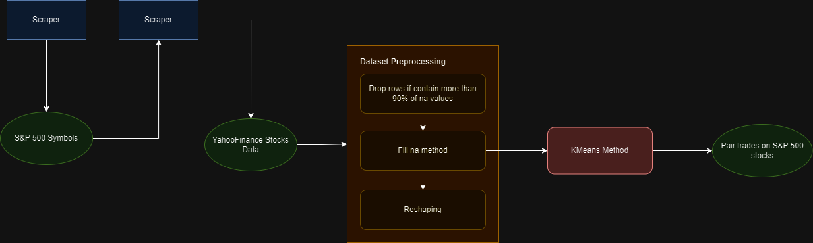

# Finding the best investments - Trading

## Overview
Through this project we want to implement an algorithmic trading technique called ‘Pairs Trading’. This technique consists of creating very similar pairs across a wide range of quotes. Once the desired number of pairs has been formed, the trading strategy then wants to sell one asset when it outperforms and buy back the second in order to make a profit.



## Data collection
- Scraping the list of S&P 500 companies: We start by obtaining the complete list of companies making up the index, which forms the basis for the following scraping steps.
- Scraping of URLs for downloading historical share prices for these companies from YahooFinance
- Script for automating the downloading of historical quotes with the library: Requests
- Saving the data: Each data set will be saved in a CSV file to facilitate subsequent analyses.

## Our data
We have 500 csv: each csv corresponds to the history of the 500 companies in the S&P 500.
Each csv contains the following columns:
- Date (day)
- Opening price
- Highest price of the day
- Lowest price of the day
- Closing price
- Adjusted closing price
- Volume of shares traded
These data are extracted for each available trading day and are structured into corresponding columns in a CSV file.

## Data cleaning
The data is already clean, so no cleaning is required.

## Model used 
Machine Learning: KMeans 

We have chosen this model because it allows us to form pairs of similar quotes from their historical price data. 
We are looking to form pairs of quotes, so the desired number of clusters is: the number of quotes available in our database divided by two. 
We then select a certain number of pairs based on the proximity of the points that make them up.

## Next step
Here's what we still have to do:
- Create our KMeans model
    + Test and adapt its parameters
- Create a script capable of finding the best pairs among the clusters created

(Potentially): Create a script capable of indicating recommended investments and divestments

## Improvement
To improve our project, we could try to increase the number of quotations making up our database.


## Installation
Provide step-by-step instructions on how to get a development environment running.

```bash
git clone https://github.com/username/projectname.git
cd projectname
pip install -r requirements.txt

streamlit run ./notebooks/scripts/streamlit.py  --client.showErrorDetails=false

```

## Usage
The notebook to run is `working_notebook.ipynb`. It contains all the code necessary to run the project.
You should automatically run all the cells in the notebook to get the results.


### Drive Folder :
https://drive.google.com/drive/folders/1jBxBjaKs8gJVh0EJ15seDMgjDhoDkbpm?usp=sharing

